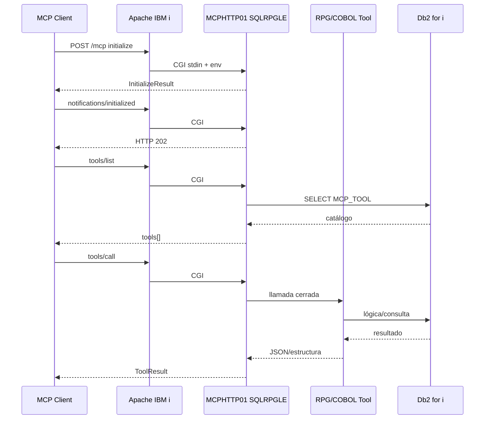

# IBM i Native MCP Server — Apache + SQLRPGLE + COBOL

Ejemplo de referencia para implementar un servidor MCP (Model Context Protocol) nativo en IBM i sin Node.js, Python, Java, PASE ni librerías externas.

## Objetivo

Exponer herramientas MCP mediante IBM HTTP Server for i (Apache) y CGI ILE RPG. El CGI procesa JSON-RPC 2.0, enruta `tools/call` y delega lógica de negocio en programas RPG/COBOL.

## Alcance del ejemplo

- Transporte: Streamable HTTP, modo síncrono.
- Endpoint: `POST /mcp`.
- GET: responde 405; no se implementa SSE.
- Sin `MCP-Session-Id` (sesiones opcionales en MCP 2025-11-25).
- Métodos:
  - `initialize`
  - `notifications/initialized`
  - `ping`
  - `tools/list`
  - `tools/call`
- Tools de ejemplo:
  - `ibmi_get_customer`
  - `ibmi_get_job_status`
  - `ibmi_simulate_credit`
- JSON: Db2 for i SQL JSON functions.
- Negocio: RPG y COBOL ILE.
- Auditoría: tabla Db2.

## Arquitectura

```text
MCP Client / AI Agent
        |
        | HTTPS + JSON-RPC 2.0
        v
IBM HTTP Server for i (Apache)
        |
        | CGI
        v
MCPHTTP01 (SQLRPGLE)
        |
        +--> initialize / ping / tools/list
        |
        +--> tools/call
               |
               +--> MCPCLT01 (SQLRPGLE)
               +--> MCPJOB01 (SQLRPGLE)
               +--> MCPCRED1 (COBOL ILE)
                        |
                        v
                    Db2 for i
```
# Flujo de ejecución


## Estructura

- `sql/001_schema.sql`: tablas MCP y datos de prueba.
- `qrpglesrc/MCPHTTP01.rpgle`: CGI/router MCP.
- `qrpglesrc/MCPCLT01.rpgle`: tool cliente.
- `qrpglesrc/MCPJOB01.rpgle`: tool job status.
- `qcblsrc/MCPCRED1.cbl`: simulación COBOL.
- `qclsrc/BUILD.cl`: comandos de compilación orientativos.
- `apache/httpd.conf.fragment`: configuración Apache.
- `tests/*.json` y `tests/test.ps1`: pruebas curl.
- `docs/SECURITY.md`: controles recomendados.
- `docs/TEST_PLAN.md`: plan de pruebas.

## Bibliotecas sugeridas

```text
MCPLIB   objetos ejecutables
MCPDATA  tablas Db2
MCPSRC   fuentes
```

## Compilación

Revise `qclsrc/BUILD.cl`. El CGI debe enlazarse con `QHTTPSVR/QZHBCGI`.

## Importante

Este proyecto es un ejemplo de referencia. Antes de producción deben validarse:

1. CCSID/UTF-8 en el entorno real.
2. PTFs y versión de IBM i.
3. Autoridades del perfil CGI.
4. Límites de tamaño de request.
5. Configuración TLS/DCM.
6. Esquemas JSON de cada tool.
7. Protección contra exposición de datos sensibles.
8. Compatibilidad exacta con el cliente MCP elegido.

No se expone ningún tool genérico para ejecutar SQL, CL o programas arbitrarios.
